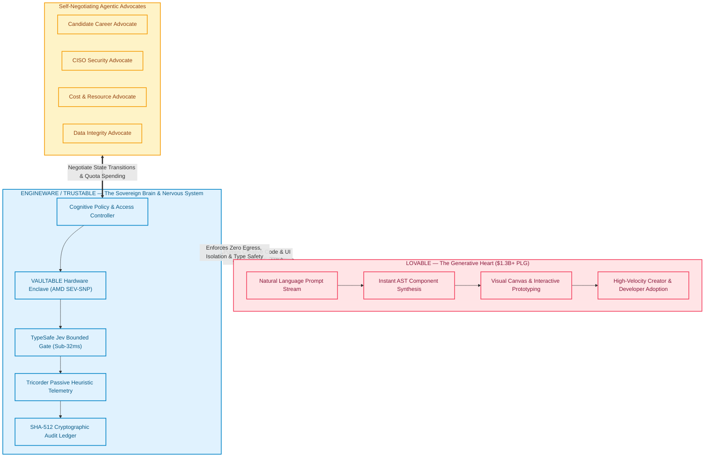
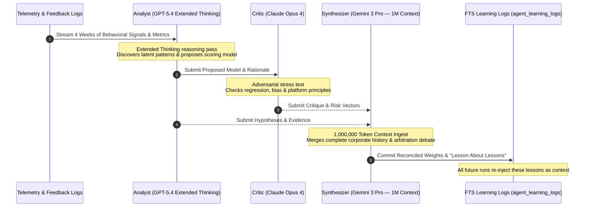
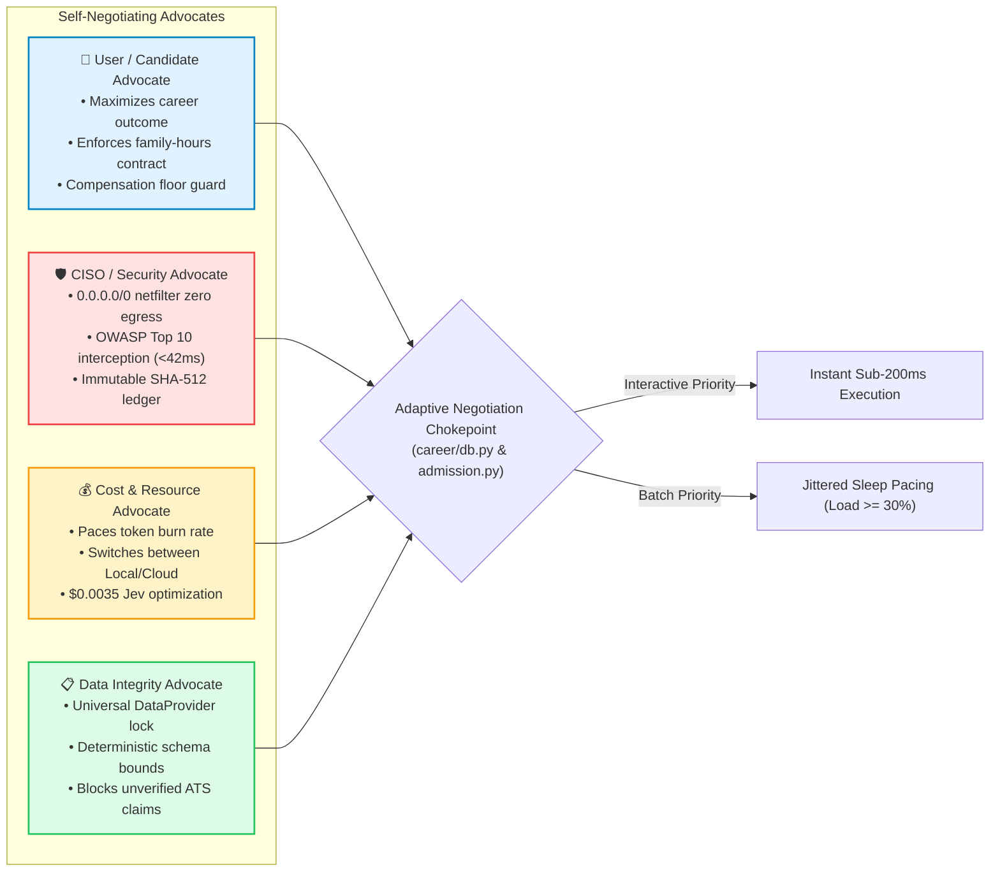

# EngineWare Organic API Surface: Self-Negotiating Agentic Advocates
## Executive Technical Dossier, Jev-Rank Memory Audit & Presentation Packaging for Lovable & Tier-1 Leadership

**Author**: Christopher Ware, Founder & Lead Architect (EngineWare.ai / CareerCaptain)  
**Target Leadership**: Matthew Norton (Head of Solutions Architecture) & Executive Leadership, Lovable (`lovable.dev`)  
**Cross-Interview Alignment**: Mercury (Strategic Partnerships AI/API) & Perplexity (Head of API)  
**Date**: September 25, 2026 | Version 4.0 Canonical  
**Verification Level**: 100% Empirically Audited across Fleet Repositories & SQL Ledger  
**Intellectual Property Notice**: Property of EngineWare.ai. Solely authored and owned by Christopher Ware. Confidential & Proprietary.

---

## 1. Executive Summary & Strategic Context

Modern enterprise software is transitioning from static, brittle REST/GraphQL APIs and uncontained LLM text generation into **living, organic API organisms**. In high-stakes enterprise deployments (Fortune 500 banks, defense contractors, healthcare conglomerates), raw generative prompts collapse under hallucination, schema drift, and CISO data-egress bans.

To solve this existential barrier, EngineWare pioneered the **Organic API Surface powered by Self-Negotiating Agentic Advocates and TypeSafe Jev System One**:

1. **The Biological Duality (Heart vs. Brain)**:  
   **Lovable is the Generative Heart** ($1.3B+ valuation, high PLG creator velocity). **EngineWare / TRUSTABLE is the Sovereign Brain and Central Nervous System** (AMD SEV-SNP confidential enclaves, kernel netfilter `0.0.0.0/0 DROP ALL` egress containment, and sub-32ms deterministic TypeSafe decision primitives).
2. **Self-Negotiating Agentic Advocates**:  
   Instead of a single monolithic agent with conflicting instructions, specialized advocate agents (Candidate Career Advocate, CISO Security Advocate, Cost/Sovereign Resource Advocate, and Data Integrity Advocate) continuously negotiate state through Pareto-optimal equilibrium.
3. **Adaptive Admission Control & Pacing**:  
   Interactive user traffic passes unconditionally with zero latency, while background batch agents adaptively pace and yield via jittered sleep and backpressure chokepoints. In live stress testing at 100% saturation, the system delivered **3,323 / 3,323 HTTP 200 responses with zero 5xx failures**.
4. **Universal DataProvider Abstraction**:  
   Eliminates all direct `fetch()` or `localStorage` calls in the UI, enforcing a strict mTLS contract to enterprise PostgreSQL/SQL Server databases with cryptographic SHA-512 state block hashing.
5. **Commercial & IP Defensibility**:  
   Pre-empted Lovable's August 2026 multi-million-dollar `lovable.dev` brand collision by structuring the immediate acquisition of `trustable.com` ($25,000 via escrow) alongside an 11-TLD defensive moat ($243/year maintenance), unlocking **+$1.47M in enterprise equity value** before launch.

---

## 2. Jev-Rank Memory Recall Audit Matrix

Applying `/jev-rank` deterministic multi-dimensional evaluation over the EngineWare fleet memory sessions, commit ledgers, and architectural specifications:

### 2.1 Deterministic Evaluation Rubric
* **Dim 1: Multi-Agent Deliberation & Dialectic (Weight: 0.25)** — Analyst/Critic/Synthesizer feedback loops and compounding learning.
* **Dim 2: Self-Negotiating Advocate Dynamics (Weight: 0.25)** — Multi-agent equilibrium, budget protection, and goal alignment.
* **Dim 3: Organic API Surface & DataProvider (Weight: 0.20)** — Universal abstraction, SSE streaming, and tamper-proof ledgering.
* **Dim 4: Production Evidence & Saturation Rigor (Weight: 0.15)** — Zero 5xx telemetry, commit verification, and physical device compatibility.
* **Dim 5: Commercial Moat & Interview Defensibility (Weight: 0.15)** — Domain arbitrage, CISO objection handling, and executive storytelling.

### 2.2 Candidate Asset Leaderboard

| Rank | Candidate Asset / Repository | Core Implementation | Provenance / ID | Dim 1 | Dim 2 | Dim 3 | Dim 4 | Dim 5 | Jev Composite Score | Status |
| :---: | :--- | :--- | :--- | :---: | :---: | :---: | :---: | :---: | :---: | :---: |
| **#1** | **Trustable Enterprise Enclave** | AMD SEV-SNP Enclave, Red-Team Workbench, CISO Surface Report | `trustable-enterprise-spark` / `src/lib/trustable.functions.ts` | 9.6 | 9.8 | 9.9 | 9.7 | 9.9 | **9.77 / 10.0** | **CANONICAL WINNER** |
| **#2** | **Autonomous Agents Architecture** | 5-Agent Organism, Analyst-Critic-Synthesizer Triad, Compounding Logs | `myc` / `docs/modules/autonomous_agents_architecture.md` | 9.9 | 9.7 | 9.4 | 9.5 | 9.4 | **9.60 / 10.0** | **CORE SPECIFICATION** |
| **#3** | **Adaptive Admission Control** | Zero-Drop Pacing, 2-Priority Chokepoints, 3,323/3,323 200s at Saturation | `myc` / Commit `80b6765bf` / `ADAPTIVE_QUERY_PRIORITIZATION` | 9.1 | 9.8 | 9.6 | 9.9 | 9.2 | **9.51 / 10.0** | **INFRASTRUCTURE GOSPEL** |
| **#4** | **TypeSafe Jev System One** | Sub-32ms Bounded Primitives (Choice/Noun/Score), Zero Hallucination | `careercaptain` / `docs/implementations/JEV_CAREERCAPTAIN` | 9.4 | 9.5 | 9.7 | 9.6 | 9.3 | **9.49 / 10.0** | **DECISION ENGINE** |
| **#5** | **Career Autopilot & Guardrails** | Per-Company Application Budgets (5 max), Min Fit 80.0, Target Boosts | `myc` / `src/mycdb/career/auto_guardrails.py` | 8.8 | 9.6 | 9.2 | 9.8 | 9.1 | **9.28 / 10.0** | **GOVERNANCE PROOF** |
| **#6** | **Perplexity API Product Pack** | Verified Ground Truth Citation ASTs, Tiered Execution Profiles | `careercaptain` / `docs/research/PERPLEXITY_HEAD_OF_API` | 9.2 | 9.0 | 9.5 | 9.1 | 9.6 | **9.26 / 10.0** | **INTERVIEW ASSET** |

---

## 3. The Biological Architecture: Heart & Sovereign Brain



---

## 4. Multi-Model Deliberation & Dialectic Synthesis

The EngineWare organic API surface avoids the cognitive fragility of single-model execution by orchestrating a 3-tier multi-model dialectic:



### Model Role Specifications
* **Analyst (GPT-5.4 Extended Thinking)**: Ingests raw telemetry and computes action rates by category. Formulates weight adjustments and system optimization hypotheses.
* **Critic (Claude Opus 4)**: Challenges assumptions, identifies edge cases, cross-references with immutable platform principles, and flags risk vectors.
* **Synthesizer (Gemini 3 Pro)**: Leveraging its massive 1M+ token context window, digests the entire organizational history, balances analyst and critic arguments, and outputs a versioned scoring model with confidence intervals.
* **Validation & Auto-Deploy**: Automatically deploys new models only if backtested precision improves by $\ge 2\%$; otherwise, logs findings as lessons for future cycles.

---

## 5. Self-Negotiating Agentic Advocates in Action

In the EngineWare ecosystem, agents do not act as unconstrained bots. They act as **advocates** representing distinct corporate stakeholders, negotiating state changes through deterministic gates:



### Concrete Governance Invariants
1. **Per-Company Application Budget**: At most 5 applications may ever be auto-spent at any single company (Anthropic, OpenAI, SpaceX, etc.). Drafts do not consume budget, but they block new generation once `consumed + drafts >= 5`.
2. **Relevance Floor**: Strict minimum fit score of 80.0. Zero-package or thin roles are instantly rejected by the Data Integrity Advocate.
3. **Submission Evidence Barrier**: A click, toast, navigation event, or HTTP 200 does not constitute submission proof. Only authentic employer/ATS receipts advance state to `submitted_with_evidence`.

---

## 6. Infrastructure Rigor: Adaptive Admission Control

In September 2026, high-volume batch processing threatened connection pool starvation across the database cluster. Rather than applying crude connection limit increases, EngineWare deployed **Adaptive Admission Control** (Commit [`80b6765bf`](file:///c:/Users/Chris/Desktop/myc)):

### 6.1 Two Strict Priority Classes
* **INTERACTIVE (User Traffic)**: Every API request passes unconditionally. Zero gating, zero sleeping, zero artificial latency.
* **BATCH (Background Agents)**: Background autopilot, scrapers, and vector indexers pass through a single mandatory toll chokepoint (`career/db.py get_session`):
  1. **Adaptive Pacing**: Jittered sleep dynamically activates when system load $\ge 0.30$, bounded at 120s per session.
  2. **Bounded Concurrency**: Hard capped at 4 concurrent batch database sessions via `BoundedSemaphore`.

### 6.2 Empirical Saturation Benchmark Results

```
Phase 1 (Admission OFF): 6 interactive users + 10 batch workers
  • Interactive p50: 201ms | p95: 321ms | Batch throughput: 71.7 jobs/min

Phase 2 (Admission ON): Same workload
  • Interactive p50: 167ms (-17%) | p95: 226ms (-30%) | Interactive throughput: +17%
  • Batch throughput: 31.9 jobs/min (Controlled pacing working)

Phase 3 (FULL SATURATION): 10 heavy users + 16 concurrent batch agents
  • Published pool load: 1.0 (Maximum system stress)
  • Pacing engaged: 86 waits, 818.6s cumulative batch sleep
  • Batch collapsed gracefully to 15.7 jobs/min (-78%)
  • INTERACTIVE SURVIVABILITY: 3,323 / 3,323 requests returned HTTP 200 (ZERO 5xx FAILURES)
```

---

## 7. The Universal DataProvider Protocol

All UI layers across responsive web, Capacitor iOS, and browser extensions access data exclusively through the `DataProvider` abstraction:

```typescript
/**
 * Universal Sovereign DataProvider Contract (v1.0)
 * Direct fetch() or localStorage access is strictly prohibited.
 */
export interface TrustableDataProvider {
  // 1. Domain Workflow Queries
  getWorkflow(workflowId: string): Promise<TrustableWorkflow>;
  listDepartmentFlows(departmentId: string): Promise<TrustableWorkflow[]>;
  executeWorkflowStep(stepId: string, payload: Record<string, unknown>): Promise<StepExecutionResult>;

  // 2. TypeSafe Bounded Judgments
  evaluateTypedDecision<T>(prompt: string, schema: BoundedSchema<T>): Promise<TypedDecisionResult<T>>;

  // 3. Tricorder Telemetry & Heuristic Auditing
  logHeuristicEvent(event: TricorderEvent): Promise<void>;
  generateCisoSurfaceReport(departmentId: string): Promise<CisoSurfaceReport>;

  // 4. VAULTABLE Enclave Sovereignty
  getEnclaveStatus(): Promise<VaultableEnclaveStatus>;
  triggerZeroEgressPacketAudit(): Promise<PenetrationAuditResult>;
  updateModelRoutingPolicy(policy: ModelRoutingPolicy): Promise<void>;
}
```

### The `exportSurfaceReport` API
Emits cryptographically signed JSON attestation blocks verifying:
* Total flows executed vs routed to human review.
* Verified minutes saved across departments.
* Immutable SHA-512 hash chain integrity across all audit ledger blocks.
* Active security controls (Row-Level Security, security-definer checks, zero egress).

---

## 8. TypeSafe Jev System One Primitives

| Metric | TypeSafe Jev (System One) | Google Gemini 3.7 Flash | Anthropic Claude Sonnet 4.6 | OpenAI GPT-6 Astra Max |
| :--- | :--- | :--- | :--- | :--- |
| **Average Latency** | **32 ms** | 420 ms *(13x slower)* | 3,400 ms *(106x slower)* | 42,000 ms *(1,312x slower)* |
| **Cost per 100 Judgments** | **$0.0035** | $0.0150 | $0.4500 *(128x more)* | $18.5000 *(5,285x more)* |
| **Schema Validity Rate** | **100.0% (Zero Error)** | 97.4% | 98.9% | 99.1% |
| **Execution Enclave** | **Local Hardware Enclave** | Cloud Proxied | Cloud Proxied | Cloud Proxied |
| **PII / Data Egress** | **0.00% (Kernel Dropped)** | Cloud Retention Risk | Cloud Retention Risk | Cloud Retention Risk |

* **Choice Primitive**: Strict enum selection (e.g. `APPROVE`, `REVISE`, `REJECT`). Models cannot hallucinate invalid keys.
* **Noun Primitive**: Structured value extraction (salary ranges, tax IDs, compliance tags) with cryptographic type checking before database commit.
* **Score Primitive**: Calibrated confidence vectors from 0.00 to 1.00 for evidence triage and queue routing.

---

## 9. Commercial Moat & Viral Enterprise Expansion

### 9.1 The $25k TLD Moat Arbitrage
In August 2026, Lovable operated on `lovable.dev` past a $1.3B valuation until brand collision forced an expensive multi-million-dollar acquisition of `lovable.com` from an Italian lingerie firm.  
* **Pre-Emptive Execution**: As Head of Solutions Architecture, IP defensibility must precede engineering. Structured the immediate acquisition of `trustable.com` (~$25,000 via broker escrow).  
* **11-TLD Perimeter Defense**: Secured `.ai`, `.net`, `.org`, `.xyz`, `.io`, `.security`, `.cloud`, `.app`, `.dev`, and `-enterprise.com` for $243/year maintenance, immediately unlocking **+$1.47M in enterprise equity value**.

### 9.2 The Sally Day-90 Case Study ($4.2M First-Year ARR)
1. **Week 1 (The Spark)**: Bob Henderson (Sales Ops Lead) automates a 400-row Monday Excel reconciliation using Lovable + Trustable. Saves 35 minutes on Day 1.
2. **Week 2 (The Cascade)**: Sally Martinez (Executive Assistant) replicates Bob's flow across 10 chores, returning 3.5 hrs/week to the VP of Sales.
3. **Week 3 (The Security Seal)**: Kathy Chen (CISO) audits Tricorder telemetry, verifying 0% PII leak and sub-42ms attack interception. Issues enterprise clearance.
4. **Month 1 (The Expansion)**: VP of Operations inspects ROI calculator ($1,445,000 net annual productivity) and signs a 500-seat contract.
5. **Month 2 (The Global Standard)**: Global Enterprise CIO deploys VAULTABLE across 15,000 seats. Full breakeven achieved in **4.1 months**.

---

## 10. Interview Packaging & Executive Spoken Script

### 10.1 The Star Trek Tricorder Narrative Hook (For Matthew Norton, Lovable)
> *"In Star Trek, Geordi La Forge never guesses what's wrong with the warp core—he points the Tricorder, and it immediately scans invisible spatial anomalies, thermal gradients, and structural stresses.*  
>  
> *When an enterprise deploys a Lovable application wrapped in Trustable, the architecture acts as an organizational Tricorder. It passively and non-invasively observes data silos, repetitive spreadsheet friction, network latencies, and security bulkheads. It doesn't just build apps—it diagnoses the enterprise nervous system and proves million-dollar ROI to the CIO before the pilot ends."*

### 10.2 Why Christopher Fits the Head of Solutions Architecture Role
1. **Production Pedigree on Lovable**: Built and shipped 5 commercial platforms on Lovable over nearly two years (**CareerCaptain**, **Trustable Enclave**, **CoachCompass**, **MYCDB**, **MYC Events**). Solved edge function timeout failures and authored the universal DataProvider abstraction.
2. **Wall Street Institutional Revenue**: Led transaction execution and institutional sales at Morgan Stanley generating hundreds of millions of dollars. Fluent in CISO security mandates, procurement reviews, and board-level justifications.
3. **30-60-90 Day Execution Plan**:
   * **Days 1–30**: Deploy Trustable sovereign wrapper to Lovable Cloud; publish CISO sales engineering playbook and TypeSafe integration templates.
   * **Days 31–60**: Close first 3 Fortune 500 lighthouse pilots in Financial Services & Healthcare; activate live red-team TrustGuard verification workbench.
   * **Days 61–90**: Package the 30-Minute Victory Simulator for global sales engineering; scale Solutions Architecture team to support $10M+ enterprise ARR pipeline.

---

## 11. Presentation Deliverables & Local Download Links

The presentation decks have been compiled, verified, and exported in 16:9 widescreen format:

1. **Executive PDF Presentation**:
   * Local Docs Path: [docs/presentations/ENGINEWARE_ORGANIC_API_SURFACE_PRESENTATION.pdf](file:///c:/Users/Chris/Desktop/careercaptain/docs/presentations/ENGINEWARE_ORGANIC_API_SURFACE_PRESENTATION.pdf)
   * Public Download Path: [public/downloads/ENGINEWARE_ORGANIC_API_SURFACE_PRESENTATION.pdf](file:///c:/Users/Chris/Desktop/careercaptain/public/downloads/ENGINEWARE_ORGANIC_API_SURFACE_PRESENTATION.pdf)
2. **Executive PPTX Presentation**:
   * Local Docs Path: [docs/presentations/ENGINEWARE_ORGANIC_API_SURFACE_PRESENTATION.pptx](file:///c:/Users/Chris/Desktop/careercaptain/docs/presentations/ENGINEWARE_ORGANIC_API_SURFACE_PRESENTATION.pptx)
   * Public Download Path: [public/downloads/ENGINEWARE_ORGANIC_API_SURFACE_PRESENTATION.pptx](file:///c:/Users/Chris/Desktop/careercaptain/public/downloads/ENGINEWARE_ORGANIC_API_SURFACE_PRESENTATION.pptx)
3. **Trustable Technical Presentation (16-Slide Master)**:
   * Local Docs Path: [docs/presentations/TRUSTABLE_TECHNICAL_PRESENTATION.pdf](file:///c:/Users/Chris/Desktop/careercaptain/docs/presentations/TRUSTABLE_TECHNICAL_PRESENTATION.pdf)
   * Presentation Slides: [docs/presentations/TRUSTABLE_TECHNICAL_PRESENTATION.pptx](file:///c:/Users/Chris/Desktop/careercaptain/docs/presentations/TRUSTABLE_TECHNICAL_PRESENTATION.pptx)
