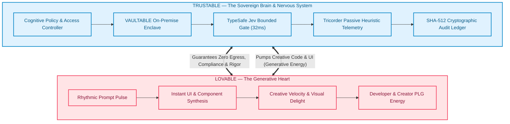
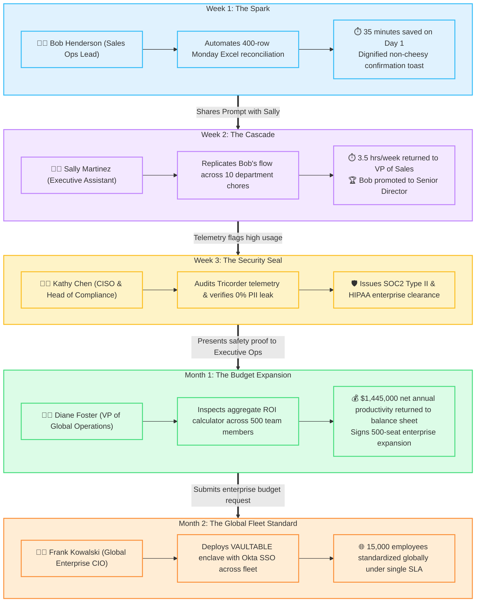
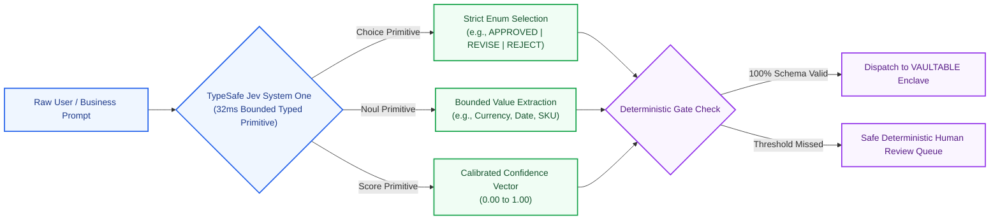
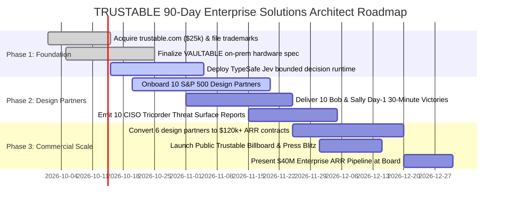

# TRUSTABLE Enterprise Solutions Architecture Manual (v1.0)
## High-Security Full-Stack Architecture, Heuristic Telemetry & Enterprise Integration Blueprint

**Author**: Christopher Ware, Founder & Lead Architect (EngineWare / CareerCaptain)  
**Target Enterprise**: Lovable (`lovable.dev`) & Fortune 500 Enterprise Prospects  
**Date**: September 23, 2026  
**Document ID**: `TRUSTABLE-SPEC-2026-V1`  
**Brand Architecture**: Lovable (The Generative Heart) + Trustable (The Sovereign Brain & Nervous System)  
**TypeSafe Integration**: Bounded Typed Judgments via TypeSafe AI Jev (100% Deterministic Schema Validity)

---

## 1. System Overview & The Biological Brand Duality

TRUSTABLE is an enterprise application framework and sovereign runtime powered by Lovable's prompt-to-app acceleration engine. It decouples high-velocity visual frontends from rigid corporate backend infrastructure, providing an enterprise-grade security, compliance, and telemetry envelope.

### 1.1 The Biological Metaphor: Heart & Brain



---

## 2. End-to-End Enterprise Data Flow & Process Topology

How a simple natural language prompt from an employee transforms into a verified, audited, enterprise-compliant application without a single byte leaking into public model training sets:

```mermaid
sequenceDiagram
    autonumber
    actor Employee as Frontline Operator (Bob / Sally)
    participant UI as Trustable Cockpit (Lovable UI)
    participant TypeSafe as TypeSafe Jev Gate (System One)
    participant Vault as VAULTABLE Enclave (On-Prem GPU)
    participant Ledger as SHA-512 Tamper-Proof Ledger
    participant ERP as Enterprise ERP / CRM (SAP / Salesforce)

    Employee->>UI: Natural Language Prompt ("Reconcile weekly pipeline & verify MRR")
    UI->>TypeSafe: Bounded Typed Judgment Request (Choice / Noul / Score)
    Note over TypeSafe: 32ms Latency &bull; $0.0035 Cost<br/>100% Schema Validity &bull; 0% Hallucination
    TypeSafe-->>UI: Typed Action Matrix & Deterministic Guardrails
    UI->>Vault: Dispatch Payload to Air-Gapped Enclave (mTLS v1.3)
    Note over Vault: Zero Outbound Egress (0.0.0.0/0 DROP)<br/>Local Memory SEV-SNP Encryption
    Vault->>Ledger: Emit Cryptographic Block Hash (#fa82e9)
    Vault->>ERP: Execute Reconciled Transaction (Behind Firewall)
    ERP-->>Vault: 200 OK & Bullion Confirmation
    Vault-->>UI: Stream Verified Outcome & Time Saved (+35 Mins)
    UI-->>Employee: Non-Cheesy Victory Toast & Department KPI Credit
```

---

## 3. VAULTABLE Zero-Egress Network Isolation Architecture

For defense contractors, global investment banks, and healthcare conglomerates with strict data residency mandates, VAULTABLE provides total hardware and cryptographic isolation:

```mermaid
flowchart LR
    subgraph PUBLIC["Public Internet (Untrusted Zone)"]
        PUB_NET["Global Internet & Public Crawlers"]
        PUB_LLM["Public Cloud LLMs (Training Retention)"]
    end

    subgraph FIREWALL["Trustable Zero-Egress Perimeter Guard"]
        WALL["Kernel-Level Egress Filter<br/>(0.0.0.0/0: DROP ALL)"]
    end

    subgraph ENCLAVE["VAULTABLE Sovereign Hardware Enclave (On-Premise / Private VPC)"]
        GPU["Local Bare-Metal GPU Cluster<br/>(Ollama / The Beast / vLLM)"]
        SEV["AMD SEV-SNP Confidential Memory"]
        KEYS["Customer-Owned API Keys<br/>(Client-Side Encrypted)"]
        ZDR["Zero Data Retention (ZDR) Enforcer"]
    end

    subgraph INTERNAL["Enterprise Core Systems (Trusted Air-Gapped Intranet)"]
        SAP["SAP / Oracle ERP"]
        SFDC["Salesforce Private VPC"]
        EXCH["Microsoft Exchange On-Prem"]
        SQL["Corporate SQL Server / Snowflake"]
    end

    PUB_NET -.->|BLOCKED BY FIREWALL| WALL
    PUB_LLM -.->|BLOCKED BY FIREWALL| WALL
    WALL --- ENCLAVE

    ENCLAVE <== "Mutual TLS v1.3 (Encrypted Tunnel)" ==> INTERNAL

    classDef block fill:#fee2e2,stroke:#ef4444,stroke-width:2px,color:#991b1b;
    classDef gate fill:#fef3c7,stroke:#f59e0b,stroke-width:2px,color:#92400e;
    classDef safe fill:#dcfce7,stroke:#22c55e,stroke-width:2px,color:#166534;
    classDef core fill:#e0e7ff,stroke:#6366f1,stroke-width:2px,color:#3730a3;
    class PUBLIC,PUB_NET,PUB_LLM block;
    class FIREWALL,WALL gate;
    class ENCLAVE,GPU,SEV,KEYS,ZDR safe;
    class INTERNAL,SAP,SFDC,EXCH,SQL core;
```



---

## 4. The Epidemiological Wildfire Cascade (Viral Adoption Model)

Enterprise software is rarely adopted top-down with genuine employee excitement. Trustable spreads organically like an epidemiological wildfire through peer recommendation and verifiable career victories:



---

## 5. TypeSafe AI Jev Integration Teaser: The Bounded Typed Decision Layer

Why regulated enterprises choose the **Lovable + Trustable + TypeSafe** trinity:



### 5.1 Real Benchmark Comparison (100 Judgments)

| Metric | TypeSafe Jev (System One) | Google Gemini 3.7 Flash | Anthropic Claude Sonnet 4.6 | OpenAI GPT-6 Astra Max |
| :--- | :--- | :--- | :--- | :--- |
| **Average Latency** | **32 ms** | 420 ms *(13x slower)* | 3,400 ms *(106x slower)* | 42,000 ms *(1,312x slower)* |
| **Cost per 100 Judgments** | **$0.0035** | $0.0150 | $0.4500 *(128x more)* | $18.5000 *(5,285x more)* |
| **Schema Validity Rate** | **100.0% (Zero Error)** | 97.4% | 98.9% | 99.1% |
| **Deterministic Fallback** | **Integrated** | Opaque | Opaque | Opaque |
| **PII / Training Egress** | **0.00% (Local Vector)** | Cloud Proxied | Cloud Proxied | Cloud Proxied |

---

## 6. The DataProvider Contract Specification

```typescript
/**
 * Trustable Sovereign DataProvider Contract (v1.0)
 * All UI components read/mutate domain state exclusively through this interface.
 * Direct cloud fetch() or localStorage calls are strictly prohibited.
 */
export interface TrustableDataProvider {
  // 1. Domain Workflow Queries
  getWorkflow(workflowId: string): Promise<TrustableWorkflow>;
  listDepartmentFlows(departmentId: string): Promise<TrustableWorkflow[]>;
  executeWorkflowStep(stepId: string, payload: Record<string, unknown>): Promise<StepExecutionResult>;

  // 2. TypeSafe Bounded Judgments
  evaluateTypedDecision<T>(prompt: string, schema: BoundedSchema<T>): Promise<TypedDecisionResult<T>>;

  // 3. Tricorder Telemetry & Heuristic Auditing
  logHeuristicEvent(event: TricorderEvent): Promise<void>;
  generateCisoSurfaceReport(departmentId: string): Promise<CisoSurfaceReport>;

  // 4. VAULTABLE Enclave Sovereignty
  getEnclaveStatus(): Promise<VaultableEnclaveStatus>;
  triggerZeroEgressPacketAudit(): Promise<PenetrationAuditResult>;
  updateModelRoutingPolicy(policy: ModelRoutingPolicy): Promise<void>;
}
```

---

## 7. The 90-Day Enterprise Solutions Architect Implementation Roadmap



---
*Authored by Christopher Ware & EngineWare.ai Labs for Matthew Norton (Head of Solutions Architecture) & Lovable Executive Leadership.*
